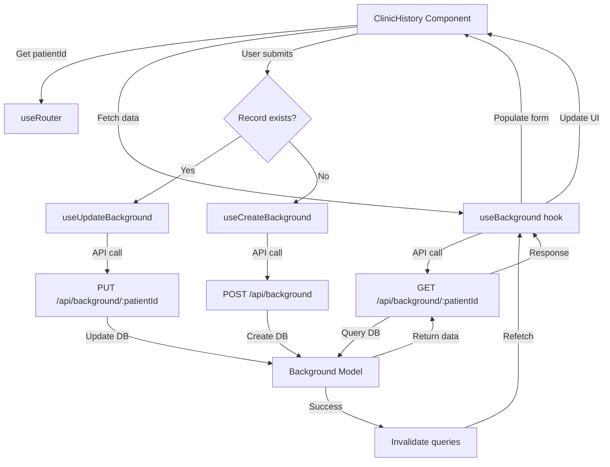

# Clinic History Implementation Plan

## Progress Tracker

**Last Updated**: 2025-10-13

| Phase | Status | Completed | Notes |
|-------|--------|-----------|-------|
| 1. Data Model Extension | ✅ Completed | 2025-10-13 | Updated Background.ts with new schema |
| 2. API Endpoints | ✅ Completed | 2025-10-13 | Created background/[id].ts with GET/POST/PUT |
| 3. Custom Hooks | ✅ Completed | 2025-10-13 | Created useBackground.ts with all hooks |
| 4. Form Implementation | ✅ Completed | 2025-10-13 | Updated ClinicHistory.tsx with full functionality |
| 5. Validation & Testing | 🔄 In Progress | - | Ready for testing |

**Legend**: ⏳ Pending | 🔄 In Progress | ✅ Completed | ❌ Blocked

---

## Overview
Implementation plan for the ClinicHistory form component that manages patient medical, family, and dental history records.

## Current State Analysis

### Existing Components
- **Form UI**: [`ClinicHistory.tsx`](src/components/PatientComponents/ClinicHistory.tsx:1) - Static form with checkboxes and text fields
- **Data Model**: [`Background.ts`](src/models/Background.ts:1) - Existing model with Type/Hma/Hoa references
- **Pattern Reference**: [`NewConsultationForm.tsx`](src/components/ModalComponents/NewConsultationForm.tsx:1) - Similar form implementation using react-hook-form

### Key Findings
1. ✅ Background model exists but needs extension for checkbox arrays
2. ✅ No API endpoints exist for Background operations
3. ✅ No custom hooks exist for Background data management
4. ✅ Form UI exists but lacks state management and data persistence
5. ✅ Pattern established: react-hook-form + TanStack Query + Material-UI

## Implementation Strategy

### Phase 1: Data Model Extension
**File**: [`src/models/Background.ts`](src/models/Background.ts:1)

**Changes**:
```typescript
export interface IBackground {
    patientId: mongoose.Types.ObjectId;
    
    // Medical History (Antecedentes Médicos)
    medicalHistory: {
        conditions: string[];  // Selected checkbox values
        notes: string;         // Additional text details
    };
    
    // Family History (Antecedentes Familiares)
    familyHistory: {
        conditions: string[];
        notes: string;
    };
    
    // Dental History (Antecedentes Odontológicos)
    dentalHistory: {
        conditions: string[];
        notes: string;
    };
    
    createdAt?: Date;
    updatedAt?: Date;
}
```

**Rationale**:
- Simple structure matching form requirements
- No complex relationships needed
- Easy to query and update
- Follows existing patterns in codebase

---

### Phase 2: API Endpoints
**File**: `src/pages/api/background/[id].ts` (NEW)

**Endpoints**:
1. **GET** `/api/background/:patientId` - Fetch patient's clinic history
2. **POST** `/api/background` - Create new clinic history record
3. **PUT** `/api/background/:patientId` - Update existing clinic history

**Implementation Pattern**:
- Follow [`consultation/index.ts`](src/pages/api/consultation/index.ts:1) pattern
- Validate patientId with mongoose.isValidObjectId
- Use db.connect() / db.disconnect()
- Return standardized ApiResponse format
- Handle errors with try/catch

**Example Structure**:
```typescript
export interface ApiResponse<T = any> {
    ok: boolean;
    data?: T;
    message?: string;
    errors?: any;
}

export default function handler(req: NextApiRequest, res: NextApiResponse<ApiResponse>) {
    switch (req.method) {
        case 'GET':
            return getBackgroundByPatientId(req, res);
        case 'POST':
            return createBackground(req, res);
        case 'PUT':
            return updateBackground(req, res);
        default:
            return res.status(400).json({ ok: false, message: 'Bad request' });
    }
}
```

---

### Phase 3: Custom Hooks
**File**: `src/hooks/useBackground.ts` (NEW)

**Hooks to Create**:
1. `useBackground(patientId)` - Fetch clinic history
2. `useCreateBackground()` - Create new record
3. `useUpdateBackground()` - Update existing record

**Implementation Pattern**:
- Follow [`useConsultation.ts`](src/hooks/useConsultation.ts:1) pattern
- Use TanStack Query (useQuery, useMutation)
- Implement query invalidation on mutations
- Add proper TypeScript types

**Example**:
```typescript
export const useBackground = (patientId: string = '') => {
    return useQuery<BackgroundResponse, Error>({
        queryKey: ['background', patientId],
        staleTime: 5 * 60 * 1000,
        retry: 2,
        enabled: !!patientId,
        queryFn: async () => {
            const response = await saludentisApi({ url: `/background/${patientId}` });
            return await response.json();
        },
    });
};
```

---

### Phase 4: Form Implementation
**File**: [`src/components/PatientComponents/ClinicHistory.tsx`](src/components/PatientComponents/ClinicHistory.tsx:1)

**Key Changes**:
1. Add react-hook-form integration
2. Implement state management for checkboxes
3. Connect to custom hooks
4. Add loading/error states
5. Implement save functionality

**Form Structure**:
```typescript
type FormData = {
    medicalHistory: {
        conditions: string[];
        notes: string;
    };
    familyHistory: {
        conditions: string[];
        notes: string;
    };
    dentalHistory: {
        conditions: string[];
        notes: string;
    };
};
```

**Implementation Steps**:
1. Get patientId from router
2. Fetch existing data with useBackground
3. Initialize form with react-hook-form
4. Handle checkbox changes with Controller
5. Submit with useCreateBackground or useUpdateBackground
6. Show success/error toasts

---

### Phase 5: Validation & Error Handling

**Validation Rules**:
- At least one checkbox or note required per section (optional)
- Notes max length: 1000 characters
- PatientId required and valid

**Error Handling**:
- Network errors → Show toast notification
- Validation errors → Display inline
- Loading states → Show CircularProgress
- Empty state → Show helpful message

---

## Implementation Checklist

### Phase 1: Backend - Data Model
- [ ] Update [`Background.ts`](src/models/Background.ts:1) model with new schema
  - [ ] Add medicalHistory field with conditions array and notes
  - [ ] Add familyHistory field with conditions array and notes
  - [ ] Add dentalHistory field with conditions array and notes
  - [ ] Remove or deprecate old typeId, hmaId, hoaId, neuroId fields
  - [ ] Update TypeScript interface
  - [ ] Test model with sample data

### Phase 2: Backend - API Endpoints
- [ ] Create `src/pages/api/background/[id].ts`
  - [ ] Implement GET handler (fetch by patientId)
  - [ ] Implement POST handler (create new record)
  - [ ] Implement PUT handler (update existing record)
  - [ ] Add patientId validation
  - [ ] Add data structure validation
  - [ ] Add error handling
  - [ ] Test all endpoints with Postman/Thunder Client

### Phase 3: Frontend - Custom Hooks
- [ ] Create `src/hooks/useBackground.ts`
  - [ ] Implement `useBackground(patientId)` query hook
  - [ ] Implement `useCreateBackground()` mutation hook
  - [ ] Implement `useUpdateBackground()` mutation hook
  - [ ] Add proper TypeScript types
  - [ ] Add query invalidation on mutations
- [ ] Export hooks from `src/hooks/index.ts`

### Phase 4: Frontend - Form Component
- [ ] Update [`ClinicHistory.tsx`](src/components/PatientComponents/ClinicHistory.tsx:1)
  - [ ] Add react-hook-form setup with Controller
  - [ ] Get patientId from router
  - [ ] Fetch existing data with useBackground
  - [ ] Initialize form with fetched data or defaults
  - [ ] Implement checkbox state management for medical history
  - [ ] Implement checkbox state management for family history
  - [ ] Implement checkbox state management for dental history
  - [ ] Connect text fields to form state
  - [ ] Add loading state (CircularProgress)
  - [ ] Add error state display
  - [ ] Implement save functionality (create or update)
  - [ ] Add success/error toast notifications
  - [ ] Add form validation

### Phase 5: Testing & Validation
- [ ] Test form with empty data (create new record)
- [ ] Test form with existing data (update record)
- [ ] Test checkbox selection/deselection
- [ ] Test text field input
- [ ] Test validation rules
- [ ] Test error scenarios (network errors, validation errors)
- [ ] Test loading states
- [ ] Test on mobile responsive view
- [ ] Verify data persistence in database

---

## Data Flow Diagram



---

## File Structure

```
src/
├── models/
│   └── Background.ts (MODIFY)
├── pages/api/
│   └── background/
│       └── [id].ts (NEW)
├── hooks/
│   ├── useBackground.ts (NEW)
│   └── index.ts (MODIFY - export new hooks)
└── components/PatientComponents/
    └── ClinicHistory.tsx (MODIFY)
```

---

## Technical Decisions

### Why extend Background model?
- ✅ Simpler than creating relationships
- ✅ Better performance (no joins)
- ✅ Matches form structure directly
- ✅ Easier to maintain

### Why use arrays for checkboxes?
- ✅ Flexible - easy to add/remove options
- ✅ Simple to query (MongoDB $in operator)
- ✅ No schema changes needed for new options
- ✅ Matches react-hook-form patterns

### Why separate notes fields?
- ✅ Clear separation of concerns
- ✅ Matches UI structure
- ✅ Easy to validate independently
- ✅ Better UX for users

---

## Next Steps

1. Review and approve this plan
2. Switch to Code mode for implementation
3. Implement in order: Model → API → Hooks → Component
4. Test each phase before moving to next
5. Deploy and monitor

---

## References

- Pattern: [`NewConsultationForm.tsx`](src/components/ModalComponents/NewConsultationForm.tsx:1)
- API Pattern: [`consultation/index.ts`](src/pages/api/consultation/index.ts:1)
- Hook Pattern: [`useConsultation.ts`](src/hooks/useConsultation.ts:1)
- Model Pattern: [`Consultation.ts`](src/models/Consultation.ts:1)