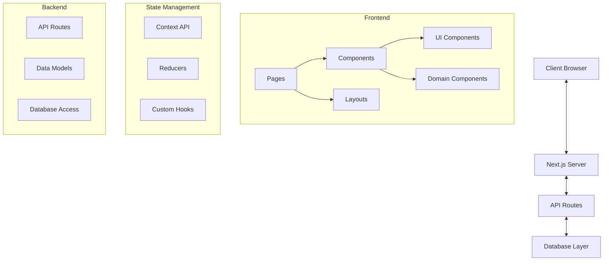
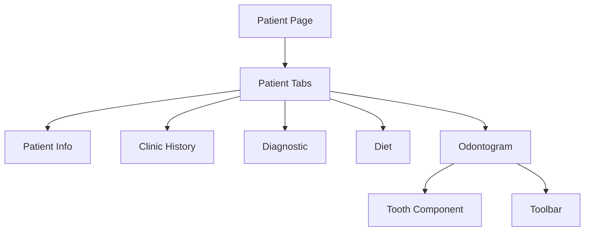
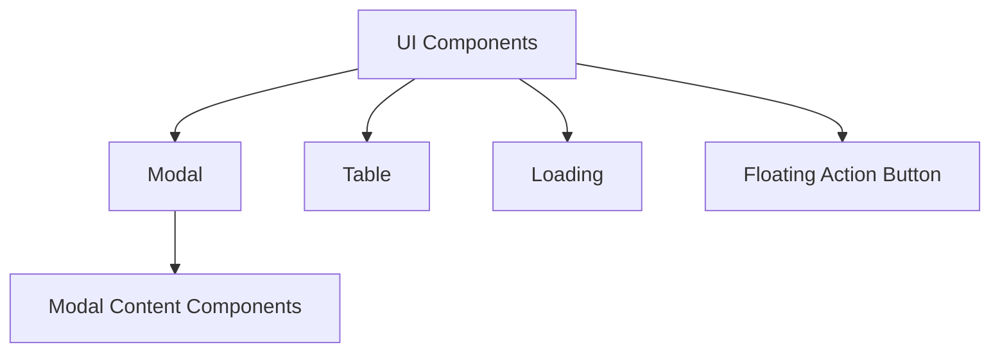
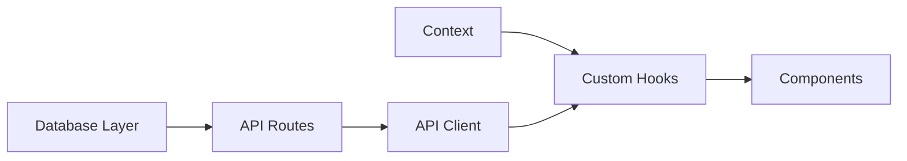

# System Patterns: Saludentis

## System Architecture

Saludentis follows a modern web application architecture based on Next.js, with clear separation of concerns and a focus on component-based development.

## Key Technical Decisions

### Frontend Framework
- **Next.js**: Chosen for its server-side rendering capabilities, routing system, and API routes
- **React**: Used for component-based UI development with functional components and hooks

### State Management
- **Context API**: Used instead of Redux for simpler state management with React's built-in Context
- **Reducers**: Implemented with the Context API for predictable state transitions
- **Custom Hooks**: Created to encapsulate and reuse stateful logic across components

### Styling Approach
- **Component-based styling**: Each component manages its own styling
- **Theme system**: Centralized theme configuration for consistent UI

### Data Fetching
- **API Routes**: Next.js API routes for backend functionality
- **Custom API client**: Wrapper around fetch/axios for consistent API access

### Authentication
- **JWT-based authentication**: Using JSON Web Tokens for secure authentication
- **Context-based auth state**: Auth state managed through React Context

## Design Patterns in Use

### Component Patterns
- **Compound Components**: Used for complex UI elements with multiple related parts
- **Container/Presentational Pattern**: Separation of data fetching/logic from presentation
- **Skeleton Components**: Used for loading states (e.g., PatientInfo.Skeleton.tsx)
- **Higher-Order Components**: Used selectively for cross-cutting concerns

### State Management Patterns
- **Context + Reducer Pattern**: Similar to Redux but using React's built-in features
- **Custom Hooks Pattern**: Encapsulating reusable stateful logic
- **Provider Pattern**: Context providers for global state access

### Data Patterns
- **Repository Pattern**: Database access abstracted through repository-like modules
- **Model Pattern**: Strong typing of domain entities
- **Service Pattern**: Business logic encapsulated in service-like modules

## Component Relationships

### Page Structure
- Pages use layouts (AppLayout, AuthLayout)
- Layouts include common elements like Navbar and SideMenu
- Pages compose domain-specific components

### Patient Management

### UI Component Hierarchy

### Data Flow

## Technical Debt and Architecture Evolution

- The system started with a simpler structure and has evolved to include more specialized components
- Some older components may not follow the latest patterns established in the system
- The database layer has been refactored to improve separation of concerns
- Authentication system has been enhanced over time for better security
